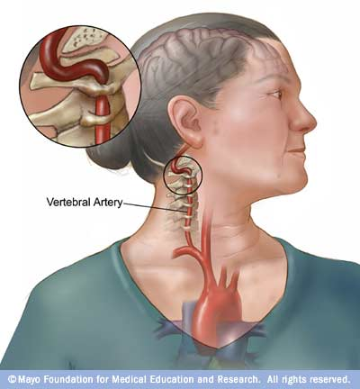

#{{ page.title }}

A Organização Mundial de Saúde, 2003 defende que o AVC é provocado por uma interrupção no suprimento de sangue ao cérebro e ocorre quando uma artéria que fornece sangue ao cérebro fica bloqueada ou se rompe.

Se as células cerebrais perdem o suprimento de oxigénio e de nutrientes por consequência elas podem parar de trabalhar temporariamente ou então, morrem. Esta morte resulta em áreas de necrose localizada que são designadas como enfartes cerebrais. Mas existem muitas células remanescentes que podem provocar o ressurgimento de movimentos perdidos se o paciente for tratado devidamente (Organização Mundial de Saúde, 2003).

Segundo Sullivan, 1993 as causas mais comuns de AVC são os trombos, o embolismo e a hemorragia secundária ao aneurisma ou a anormalidades do desenvolvimento. E advoga que as outras causas menos comuns são os tumores, os abcessos, os processos inflamatórios e os traumatismos.

Consoante a Organização Mundial de Saúde, 2003 as causas mais frequentes de AVC compreendem os enfartes cerebrais, a hipertensão arterial, a hemorragia cerebral, a malformação dos vasos sanguíneos, os tumores cerebrais, os traumas e outras situações diversas.

Os enfartes cerebrais resultam de dois processos patológicos, a trombose, que é o bloqueio de uma artéria do cérebro, causado por um coágulo sanguíneo sólido ou trombo que se forma dentro do sistema vascular; e a embolia, que é um bloqueio causado por um fragmento destacado do trombo que se formou em outro local e é levado para o cérebro pela corrente sanguínea (OMS, 2003).
